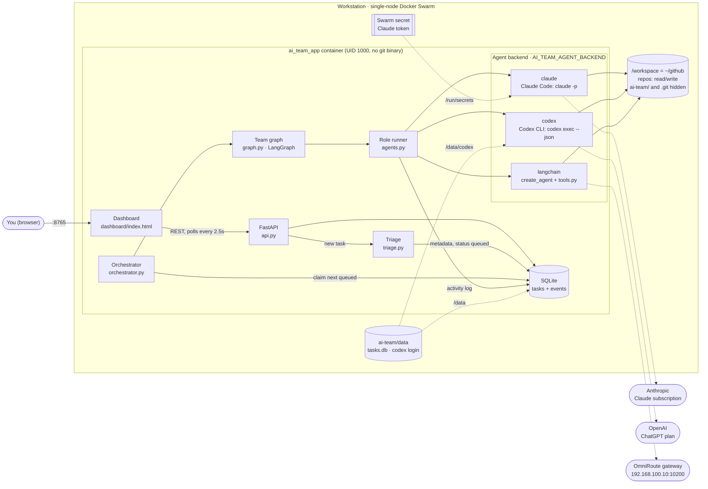
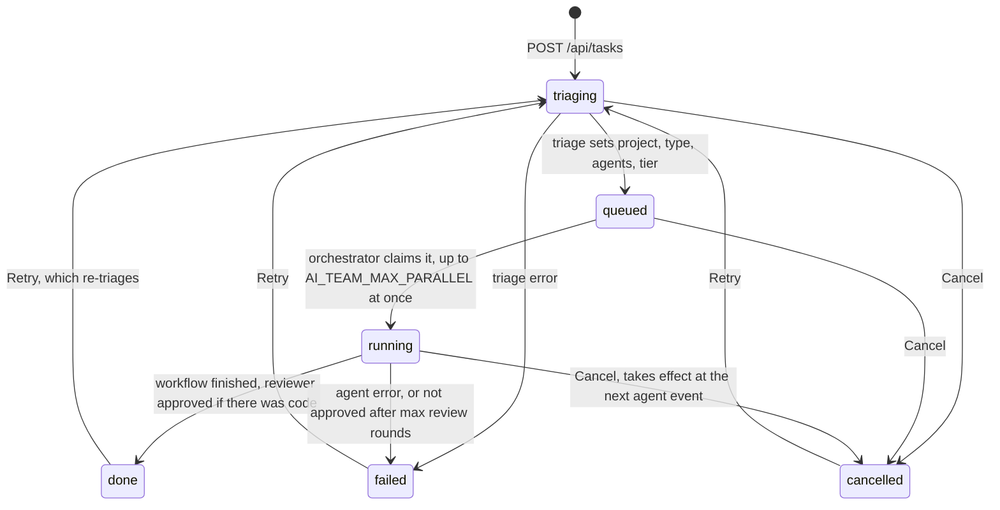
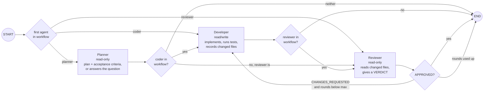
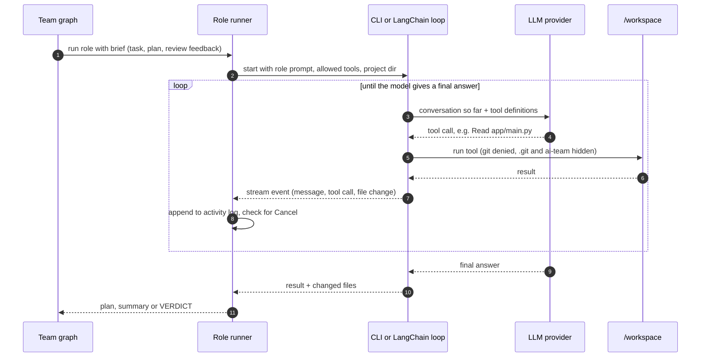
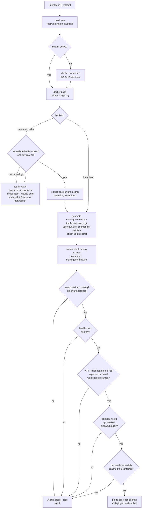
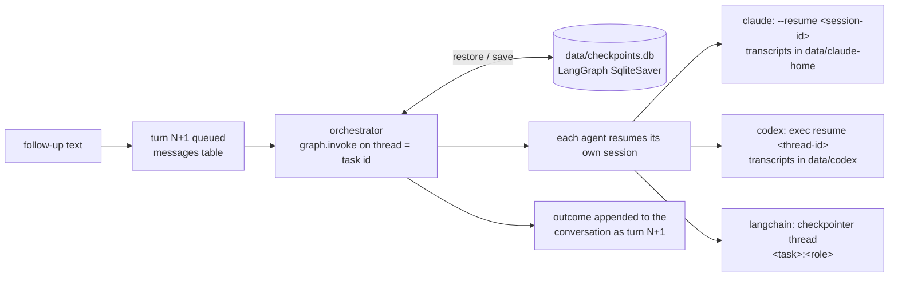

# AI Team (POC)

A dashboard where you type tasks in plain words. Each task is triaged into metadata, queued, then worked
by a team of agents (planner → senior developer → reviewer) orchestrated with **LangGraph**.

Setup: `cp .env.example .env`, then pick a provider and add its key (`mock` works with no key).
For local dev: `python3 -m venv .venv && .venv/bin/pip install -r requirements.txt`.

## Deploy (Docker Swarm stack)

```bash
cd ai-team
./deploy.sh          # builds ai-team:latest, `docker swarm init` if needed, deploys stack `ai_team`
```

- Single-node swarm on this workstation. The control plane is bound to `127.0.0.1:2377`.
- Dashboard: `http://<host>:8765` (`AI_TEAM_PORT` to change). Published in host mode, so it's **reachable
  from the LAN with no auth**.
- Config comes from `ai-team/.env` (`env_file`). Edit it, then re-run `./deploy.sh`. Comments must be on
  their own lines; Docker keeps inline `# …` as part of the value.
- Task DB lives on the host at `ai-team/data/tasks.db`.
- **Every deploy is verified** before the script reports success:
  - the new container is running, with no swarm rollback
  - the Docker healthcheck reports healthy
  - API and dashboard answer on the port, with the expected backend and the workspace mounted
  - isolation holds (no git, `.git` masked, `ai-team/` hidden)
  - the backend has its credentials or gateway

  On any failure it prints the service tasks and the last logs, then exits 1. A version that doesn't
  start is rolled back by swarm automatically (`update_config.failure_action: rollback`).
  `DEPLOY_TIMEOUT` (default 180s) bounds the wait.
- Logs: `docker service logs -f ai_team_app` · Remove: `docker stack rm ai_team`.
- Every deploy builds a uniquely tagged image so the service actually rolls. Deploys also regenerate
  `stack.generated.yml`, so **re-run after adding a repo** to get its `.git` masked.

**Isolation in the container.** Bubblewrap can't run inside a container under Docker's AppArmor profile,
so the container itself is the sandbox:
- It sees only `~/github` (mounted at `/workspace`). The rest of the host, including `~/.ssh`, is invisible.
- `/workspace/ai-team` is covered by an empty tmpfs.
- Every `.git` dir is covered by an empty tmpfs, and every submodule `.git` file by `/dev/null`.
- The image has no git binary.
- It runs as UID 1000, so files the coder writes stay owned by you.

### Agent backends

`AI_TEAM_AGENT_BACKEND` in `.env` picks who runs the agents. The CLI backends use **subscriptions,
not pay-as-you-go API keys**.

| Backend | Who runs each role | Auth (`./deploy.sh` does the login) | Where the credential lives |
|---|---|---|---|
| `claude` | Claude Code headless (`claude -p`) | `claude setup-token` (browser), ~1-year inference-only token | `ai-team/data/claude/oauth_token` (mode 600, gitignored) → swarm secret → `/run/secrets/claude_oauth_token` |
| `codex` | Codex CLI headless (`codex exec --json`) | `codex login --device-auth` (ChatGPT plan), run inside the image | `ai-team/data/codex/` (mode 700, gitignored), mounted at `/data/codex` |
| `langchain` | LangChain `create_agent` + `tools.py` | `AI_TEAM_PROVIDER` / base URL | `.env` |

- **Checked before every deploy:** the stored credential is tested with one tiny real call ("Reply with
  exactly: OK") from a throwaway container of the new image. If it's missing or rejected, e.g.
  `401 OAuth access token is invalid`, the script logs in again, updates the file and re-checks. Login
  needs an interactive terminal; non-interactive runs stop with a clear error before touching the stack.
- **Rotate on demand:** `./deploy.sh --relogin`.
- **The Claude swarm secret is named after the token's hash**, so it's recreated only when the token changes.
- **Non-interactive seeding:** `CLAUDE_CODE_OAUTH_TOKEN=… ./deploy.sh` saves the given token to the file.
- **Both CLIs log in separately from the host CLIs.** Copying the host's stored login would break: Claude's
  access token expires within hours, and both CLIs rotate refresh tokens, so host and container would log
  each other out.
- **Codex's credentials can't be a swarm secret.** Swarm secrets are read-only, but Codex rewrites its
  tokens when it refreshes them.

**Role limits:**
- **Claude:**
  - planner and reviewer: `Read,Grep,Glob`
  - coder: adds `Edit,Write,Bash`
  - always denied: `git`, web tools, reading `/run/secrets`
  - models per tier: `AI_TEAM_CLI_MODEL_*`
- **Codex:**
  - Its own sandbox needs bubblewrap, which Docker's AppArmor blocks, so it runs with `--dangerously-bypass-approvals-and-sandbox` and the container is the sandbox.
  - It can't be limited to read-only tools. Planner and reviewer are told they're read-only, and **a step fails if they change any file**.
  - Tiers set reasoning effort `low`/`medium`/`high`. `AI_TEAM_CODEX_MODEL_*` empty means your plan's default model.

**Shared caveat:** agents run as the same user that can read their credentials (the Claude token file, or
`/data/codex/auth.json`, plus the task DB in `/data`). A shell command could print them. Treat credentials
as exposed to whatever the agents read, and re-login if a repo looks hostile.

## Run without Docker (dev)

```bash
.venv/bin/python -m ai_team   # http://127.0.0.1:8765 — stop the stack first, same port
```

## Architecture

### System overview

Everything runs in one container on a single-node Docker Swarm. The only host folder it can write to is
the root working dir (`~/github`), mounted at `/workspace`.



### Task lifecycle



### Team graph (LangGraph)

Triage picks the `workflow`, and routing skips the agents a task doesn't need. A review-only task goes
straight to the reviewer, and a question goes only to the planner.



### One agent step

The model never touches the disk. It asks for a tool, and the tool runs inside the container. Whatever a
tool reads is sent to the provider as text.



### Deploy flow (`./deploy.sh`)



| Module | Responsibility |
|---|---|
| `config.py` | Settings from env / `.env` (`AI_TEAM_*`) |
| `db.py` | Task + event persistence (SQLite, `data/tasks.db`) |
| `llm.py` | Model factory (`init_chat_model`), tier → model |
| `triage.py` | Task → metadata (LLM; keyword heuristic under `mock`) |
| `agents.py` | Role definitions + role runner; dispatches to the configured backend, streams activity into the event log |
| `cli_agent.py` | Claude Code backend (`claude -p`, per-role tool limits, token from the swarm secret) |
| `codex_cli.py` | Codex CLI backend (`codex exec --json`, ChatGPT login state, read-only guard) |
| `tools.py` | Sandboxed workspace tools for the `langchain` backend |
| `graph.py` | LangGraph workflow and routing |
| `orchestrator.py` | Queue worker, status transitions, cancellation, crash recovery; runs each turn on the task's checkpointed thread |
| `memory.py` | LangGraph SQLite checkpointer (`data/checkpoints.db`): team-graph state and agent threads per task |
| `api.py` | REST API + serves the dashboard |

### Continue chat (follow-ups)

A task is a conversation. Once it's done, failed or cancelled, the dashboard's **Continue this task** box
(or `POST /api/tasks/{id}/messages {"text": …}`) queues another turn on the same task, like resuming a
`claude` CLI session. The same team picks it up with its memory:



- **What carries over** in the graph checkpoint (thread = task id): plan, result, review, and each agent's
  session id. **Reset each turn:** review rounds, approval and the changed-files list.
- **Every follow-up brief** has the original task, a compact history of earlier turns and the new request.
  An agent that has no session yet (e.g. tasks from before this feature) still has the full context.
- **The follow-up reuses the task's triage** (project, agents, tier); it isn't re-triaged.
- **Retry** re-runs only the latest turn. Retrying turn 1 starts over: re-triage, and all memory for the
  task is forgotten.
- **Storage:** everything is local in `ai-team/data/` (SQLite + CLI transcript folders, gitignored).
  Redis could replace the SQLite checkpointer later (`langgraph-checkpoint-redis`), e.g. for several
  orchestrator replicas.

### Re-verify (is it actually done?)

**Verify** on a finished task, or `POST /api/tasks/{id}/verify`, queues an independent check of the
**current code** against **every request in the task's conversation**:

- **A separate `verifier` agent**, started fresh each time (no shared session, so it doesn't inherit the team's
  assumptions). It gets all user requests, the files changed across all turns, and the developer's last
  summary as *claims to check*.
- **It reads code and runs tests/builds but must not edit:**
  - claude: `Read,Grep,Glob,Bash`, with git denied
  - codex: the step fails if it edits files
  - langchain: read tools + `run_command`
- **The report:** a checklist (`[x]` met / `[~]` partly / `[ ]` not met) with evidence, the gaps as concrete
  fixes, and a final `VERIFICATION: DONE | PARTIAL | NOT_DONE`.
- **The verdict is stored next to the task** (`verify_state`, `verification`, `verified_at`), shown as a badge,
  and added to the conversation. It **never changes the task's status**.
- **On PARTIAL or NOT_DONE,** **Continue with gaps** prefills a follow-up asking the team to fix them. The
  verifier's report is part of the conversation history the team sees.
- **It runs through the orchestrator queue** (counts against `AI_TEAM_MAX_PARALLEL`), never while the task
  itself is running. A new turn or retry clears the earlier verdict as stale.

### Model selection
Triage sets `model_tier` (`fast` / `balanced` / `deep`). It maps to `AI_TEAM_MODEL_FAST/BALANCED/DEEP`.
The provider (`anthropic`, `openai`, `ollama`, …) is global, via `AI_TEAM_PROVIDER`.

### Boundaries
- **Filesystem:** Agents only see `AI_TEAM_WORKSPACE_ROOT` (default: the folder containing `ai-team/`).
  Each top-level folder there is a project. Paths outside it, `ai-team/` itself and `.env*` files are denied.
- **No git at all:** There is no git tool, any command mentioning git is refused, and `.git/` folders
  can't be read. The coder's write tools record changed files, and that list is what the reviewer gets.
- **Shell (dev mode):** `run_command` runs under **bubblewrap**. The whole filesystem is read-only except the workspace.
  `ai-team/` and every `.git/` are hidden, and the git binary is masked. Network stays open so agents can
  talk to local services. Without `bwrap` it falls back to a plain shell (only the regex guard applies).

### Known POC limits
- In dev mode `run_command` can still *read* files outside the workspace (e.g. `~/.ssh`); the stack doesn't have this gap.
- The dashboard/API has no auth, and the stack publishes it on the LAN.
- Polling instead of SSE/websockets; a single process holds the API, triage and orchestrator.
- A task interrupted by a restart re-runs its current turn from the start (earlier turns are kept).
- Cancelling a running task takes effect at the next agent step, not instantly.

## Next steps (toward the full "company")
More roles (QA/tester, DevOps, security reviewer) as new graph nodes. A supervisor node that routes
dynamically instead of a fixed workflow. LangGraph checkpointer (SQLite) for resume and human-in-the-loop
approval. Parallel tasks with per-project locking. Per-role model overrides. SSE live log.
